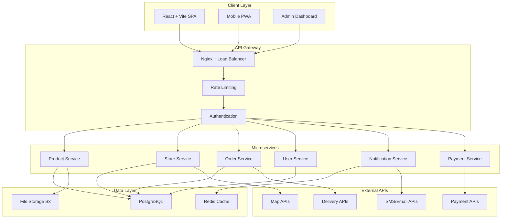
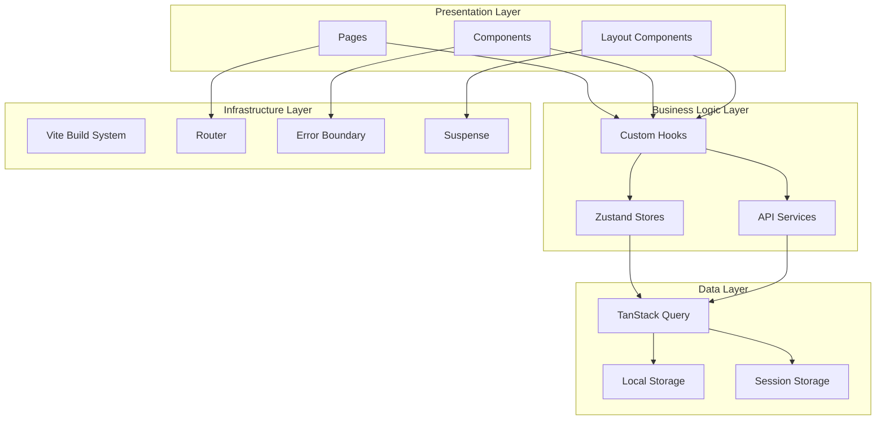

# Design Document

## Overview

한국 편의점 웹사이트는 현대적인 React + Vite 기반의 SPA(Single Page Application)로 설계됩니다. 18개의 핵심 요구사항을 충족하는 확장 가능하고 유지보수가 용이한 아키텍처를 구현하며, 마이크로서비스 아키텍처와 모듈러 프론트엔드 설계를 통해 각 기능을 독립적으로 개발하고 배포할 수 있도록 합니다.

## Architecture

### 전체 시스템 아키텍처



### 프론트엔드 아키텍처



## Components and Interfaces

### 핵심 컴포넌트 구조

#### 1. 상품 관리 컴포넌트
```typescript
// Product Components Hierarchy
ProductsPage
├── ProductSearch
│   ├── SearchInput
│   ├── FilterPanel
│   └── SortOptions
├── ProductGrid
│   ├── ProductCard
│   │   ├── ProductImage
│   │   ├── ProductInfo
│   │   ├── PriceDisplay
│   │   └── AddToCartButton
│   └── ProductPagination
└── ProductDetail
    ├── ProductGallery
    ├── ProductSpecs
    ├── ReviewSection
    └── RelatedProducts
```

#### 2. 매장 관리 컴포넌트
```typescript
// Store Components Hierarchy
StoresPage
├── StoreSearch
│   ├── LocationInput
│   ├── ServiceFilter
│   └── DistanceFilter
├── StoreMap
│   ├── MapContainer
│   ├── StoreMarkers
│   └── MapControls
├── StoreList
│   ├── StoreCard
│   │   ├── StoreInfo
│   │   ├── OperatingHours
│   │   ├── ServicesIcons
│   │   └── DirectionsButton
│   └── StoreDetail
└── StoreServices
    ├── ServiceList
    └── ServiceDetail
```

#### 3. 주문 관리 컴포넌트
```typescript
// Order Components Hierarchy
OrderPage
├── Cart
│   ├── CartItems
│   │   ├── CartItem
│   │   ├── QuantityControl
│   │   └── RemoveButton
│   ├── CartSummary
│   └── CheckoutButton
├── OrderForm
│   ├── StoreSelection
│   ├── PaymentMethod
│   ├── ContactInfo
│   └── OrderConfirmation
└── OrderHistory
    ├── OrderList
    ├── OrderDetail
    └── OrderTracking
```

### 인터페이스 설계

#### API 인터페이스
```typescript
// API Response 표준 형식
interface ApiResponse<T> {
  success: boolean;
  data: T;
  message?: string;
  pagination?: PaginationInfo;
  timestamp: string;
}

interface ApiError {
  success: false;
  error: {
    code: string;
    message: string;
    details?: any;
  };
  timestamp: string;
  path: string;
}

// 상품 API 인터페이스
interface ProductAPI {
  getProducts(params: ProductQueryParams): Promise<ApiResponse<Product[]>>;
  getProduct(id: string): Promise<ApiResponse<Product>>;
  searchProducts(query: string, filters?: ProductFilters): Promise<ApiResponse<Product[]>>;
  getProductsByCategory(category: string): Promise<ApiResponse<Product[]>>;
  getDiscountProducts(): Promise<ApiResponse<Product[]>>;
  getNewProducts(): Promise<ApiResponse<Product[]>>;
}

// 매장 API 인터페이스
interface StoreAPI {
  getStores(params?: StoreQueryParams): Promise<ApiResponse<Store[]>>;
  getStore(id: string): Promise<ApiResponse<Store>>;
  getNearbyStores(coordinates: Coordinates, radius?: number): Promise<ApiResponse<Store[]>>;
  getStoreServices(storeId: string): Promise<ApiResponse<StoreService[]>>;
  searchStores(query: string): Promise<ApiResponse<Store[]>>;
}

// 주문 API 인터페이스
interface OrderAPI {
  createOrder(orderData: CreateOrderRequest): Promise<ApiResponse<Order>>;
  getOrder(id: string): Promise<ApiResponse<Order>>;
  getUserOrders(userId: string): Promise<ApiResponse<Order[]>>;
  updateOrderStatus(id: string, status: OrderStatus): Promise<ApiResponse<Order>>;
  cancelOrder(id: string): Promise<ApiResponse<void>>;
}
```

#### 상태 관리 인터페이스
```typescript
// Zustand Store 인터페이스
interface AuthStore {
  user: User | null;
  isAuthenticated: boolean;
  isLoading: boolean;
  login: (credentials: LoginCredentials) => Promise<void>;
  logout: () => void;
  register: (userData: RegisterData) => Promise<void>;
  updateProfile: (data: Partial<User>) => Promise<void>;
  refreshToken: () => Promise<void>;
}

interface CartStore {
  items: CartItem[];
  totalAmount: number;
  totalItems: number;
  selectedStore: Store | null;
  addItem: (product: Product, quantity?: number) => void;
  removeItem: (productId: string) => void;
  updateQuantity: (productId: string, quantity: number) => void;
  clearCart: () => void;
  setStore: (store: Store) => void;
  calculateTotal: () => number;
}

interface UIStore {
  isLoading: boolean;
  notifications: Notification[];
  modals: ModalState;
  theme: 'light' | 'dark';
  language: 'ko' | 'en' | 'zh' | 'ja';
  setLoading: (loading: boolean) => void;
  addNotification: (notification: Notification) => void;
  removeNotification: (id: string) => void;
  openModal: (modal: ModalType, props?: any) => void;
  closeModal: () => void;
  setTheme: (theme: 'light' | 'dark') => void;
  setLanguage: (language: string) => void;
}
```

## Data Models

### 핵심 데이터 모델

#### 상품 모델
```typescript
interface Product {
  id: string;
  name: string;
  nameEn?: string;
  description: string;
  category: ProductCategory;
  subCategory: string;
  brand: string;
  manufacturer: string;
  
  // 가격 정보
  price: number;
  originalPrice?: number;
  discountType?: DiscountType;
  discountValue?: number;
  discountStartDate?: Date;
  discountEndDate?: Date;
  
  // 상품 정보
  images: ProductImage[];
  barcode?: string;
  weight?: number;
  volume?: number;
  dimensions?: Dimensions;
  
  // 영양 정보 (즉석식품용)
  nutritionInfo?: NutritionInfo;
  allergyInfo: string[];
  ingredients: string[];
  
  // 상태 정보
  isAvailable: boolean;
  stock: number;
  minStock: number;
  isNew: boolean;
  isPremium: boolean;
  isAdultOnly: boolean;
  
  // 평점 및 리뷰
  rating: number;
  reviewCount: number;
  
  // 메타데이터
  tags: string[];
  seoTitle?: string;
  seoDescription?: string;
  createdAt: Date;
  updatedAt: Date;
}

interface ProductImage {
  id: string;
  url: string;
  alt: string;
  order: number;
  type: 'main' | 'gallery' | 'thumbnail';
}

interface NutritionInfo {
  calories: number;
  protein: number;
  fat: number;
  carbohydrates: number;
  sodium: number;
  sugar: number;
  servingSize: string;
}
```

#### 매장 모델
```typescript
interface Store {
  id: string;
  name: string;
  brand: ConvenienceStoreBrand;
  
  // 위치 정보
  address: Address;
  coordinates: Coordinates;
  region: string;
  district: string;
  
  // 연락처 정보
  phone: string;
  email?: string;
  
  // 운영 정보
  operatingHours: OperatingHours;
  is24Hours: boolean;
  holidays: string[];
  
  // 서비스 및 시설
  services: StoreService[];
  facilities: StoreFacility[];
  hasParking: boolean;
  parkingSpaces?: number;
  
  // 상태 정보
  isActive: boolean;
  isTemporarilyClosed: boolean;
  
  // 메타데이터
  createdAt: Date;
  updatedAt: Date;
}

interface Address {
  street: string;
  city: string;
  state: string;
  zipCode: string;
  country: string;
  fullAddress: string;
}

interface Coordinates {
  latitude: number;
  longitude: number;
}

interface OperatingHours {
  monday: DayHours;
  tuesday: DayHours;
  wednesday: DayHours;
  thursday: DayHours;
  friday: DayHours;
  saturday: DayHours;
  sunday: DayHours;
}

interface DayHours {
  open: string; // "09:00"
  close: string; // "22:00"
  is24Hours: boolean;
  isClosed: boolean;
}
```

#### 사용자 모델
```typescript
interface User {
  id: string;
  email: string;
  phone: string;
  
  // 개인 정보
  name: string;
  firstName?: string;
  lastName?: string;
  birthDate?: Date;
  gender?: Gender;
  
  // 멤버십 정보
  membershipTier: MembershipTier;
  membershipNumber: string;
  points: number;
  totalSpent: number;
  joinDate: Date;
  
  // 설정
  preferences: UserPreferences;
  addresses: UserAddress[];
  paymentMethods: PaymentMethod[];
  
  // 알림 설정
  notificationSettings: NotificationSettings;
  
  // 상태 정보
  isActive: boolean;
  isVerified: boolean;
  lastLoginAt?: Date;
  
  // 메타데이터
  createdAt: Date;
  updatedAt: Date;
}

interface UserPreferences {
  language: string;
  currency: string;
  timezone: string;
  favoriteCategories: string[];
  favoriteStores: string[];
  dietaryRestrictions: string[];
  allergyInfo: string[];
}

interface NotificationSettings {
  email: boolean;
  sms: boolean;
  push: boolean;
  marketing: boolean;
  orderUpdates: boolean;
  promotions: boolean;
  newProducts: boolean;
}
```

#### 주문 모델
```typescript
interface Order {
  id: string;
  orderNumber: string;
  userId: string;
  storeId: string;
  
  // 주문 항목
  items: OrderItem[];
  
  // 금액 정보
  subtotal: number;
  discountAmount: number;
  taxAmount: number;
  totalAmount: number;
  
  // 결제 정보
  paymentMethod: PaymentMethod;
  paymentStatus: PaymentStatus;
  paymentId?: string;
  
  // 주문 상태
  status: OrderStatus;
  statusHistory: OrderStatusHistory[];
  
  // 픽업 정보
  pickupCode: string;
  estimatedPickupTime: Date;
  actualPickupTime?: Date;
  pickupInstructions?: string;
  
  // 고객 정보
  customerInfo: CustomerInfo;
  
  // 메타데이터
  createdAt: Date;
  updatedAt: Date;
  completedAt?: Date;
  cancelledAt?: Date;
  cancellationReason?: string;
}

interface OrderItem {
  id: string;
  productId: string;
  product: Product;
  quantity: number;
  unitPrice: number;
  totalPrice: number;
  discountAmount?: number;
  specialInstructions?: string;
}

interface OrderStatusHistory {
  status: OrderStatus;
  timestamp: Date;
  note?: string;
  updatedBy?: string;
}

enum OrderStatus {
  PENDING = 'pending',
  CONFIRMED = 'confirmed',
  PREPARING = 'preparing',
  READY = 'ready',
  COMPLETED = 'completed',
  CANCELLED = 'cancelled',
  EXPIRED = 'expired'
}
```

## Error Handling

### 에러 처리 전략

#### 1. 프론트엔드 에러 처리
```typescript
// Error Boundary 컴포넌트
class ErrorBoundary extends Component<ErrorBoundaryProps, ErrorBoundaryState> {
  constructor(props: ErrorBoundaryProps) {
    super(props);
    this.state = { hasError: false, error: null };
  }

  static getDerivedStateFromError(error: Error): ErrorBoundaryState {
    return { hasError: true, error };
  }

  componentDidCatch(error: Error, errorInfo: ErrorInfo) {
    // 에러 로깅
    console.error('Error Boundary caught an error:', error, errorInfo);
    
    // 에러 리포팅 서비스로 전송
    errorReportingService.reportError(error, {
      componentStack: errorInfo.componentStack,
      errorBoundary: true,
      timestamp: new Date().toISOString(),
      userAgent: navigator.userAgent,
      url: window.location.href
    });
  }

  render() {
    if (this.state.hasError) {
      return (
        <ErrorFallback 
          error={this.state.error}
          resetError={() => this.setState({ hasError: false, error: null })}
        />
      );
    }

    return this.props.children;
  }
}

// API 에러 처리
class ApiError extends Error {
  constructor(
    public status: number,
    public code: string,
    message: string,
    public details?: any
  ) {
    super(message);
    this.name = 'ApiError';
  }
}

// HTTP 클라이언트 에러 인터셉터
axios.interceptors.response.use(
  (response) => response,
  (error) => {
    const { response } = error;
    
    if (response) {
      // 서버 응답이 있는 경우
      const apiError = new ApiError(
        response.status,
        response.data?.error?.code || 'UNKNOWN_ERROR',
        response.data?.error?.message || 'An error occurred',
        response.data?.error?.details
      );
      
      // 특정 에러 코드에 대한 처리
      switch (response.status) {
        case 401:
          // 인증 에러 - 로그아웃 처리
          useAuthStore.getState().logout();
          break;
        case 403:
          // 권한 에러 - 접근 거부 페이지로 리다이렉트
          window.location.href = '/access-denied';
          break;
        case 429:
          // Rate Limit - 사용자에게 알림
          useUIStore.getState().addNotification({
            type: 'warning',
            message: '요청이 너무 많습니다. 잠시 후 다시 시도해주세요.'
          });
          break;
      }
      
      return Promise.reject(apiError);
    } else if (error.request) {
      // 네트워크 에러
      return Promise.reject(new ApiError(0, 'NETWORK_ERROR', '네트워크 연결을 확인해주세요.'));
    } else {
      // 기타 에러
      return Promise.reject(new ApiError(0, 'UNKNOWN_ERROR', error.message));
    }
  }
);
```

#### 2. 에러 타입 정의
```typescript
// 에러 코드 정의
enum ErrorCode {
  // 인증 관련
  UNAUTHORIZED = 'UNAUTHORIZED',
  FORBIDDEN = 'FORBIDDEN',
  TOKEN_EXPIRED = 'TOKEN_EXPIRED',
  
  // 상품 관련
  PRODUCT_NOT_FOUND = 'PRODUCT_NOT_FOUND',
  PRODUCT_OUT_OF_STOCK = 'PRODUCT_OUT_OF_STOCK',
  INVALID_PRODUCT_DATA = 'INVALID_PRODUCT_DATA',
  
  // 주문 관련
  ORDER_NOT_FOUND = 'ORDER_NOT_FOUND',
  INVALID_ORDER_STATUS = 'INVALID_ORDER_STATUS',
  PAYMENT_FAILED = 'PAYMENT_FAILED',
  STORE_CLOSED = 'STORE_CLOSED',
  
  // 시스템 관련
  NETWORK_ERROR = 'NETWORK_ERROR',
  SERVER_ERROR = 'SERVER_ERROR',
  RATE_LIMIT_EXCEEDED = 'RATE_LIMIT_EXCEEDED',
  MAINTENANCE_MODE = 'MAINTENANCE_MODE'
}

// 에러 메시지 매핑
const ERROR_MESSAGES: Record<ErrorCode, string> = {
  [ErrorCode.UNAUTHORIZED]: '로그인이 필요합니다.',
  [ErrorCode.FORBIDDEN]: '접근 권한이 없습니다.',
  [ErrorCode.TOKEN_EXPIRED]: '세션이 만료되었습니다. 다시 로그인해주세요.',
  [ErrorCode.PRODUCT_NOT_FOUND]: '상품을 찾을 수 없습니다.',
  [ErrorCode.PRODUCT_OUT_OF_STOCK]: '상품이 품절되었습니다.',
  [ErrorCode.INVALID_PRODUCT_DATA]: '잘못된 상품 정보입니다.',
  [ErrorCode.ORDER_NOT_FOUND]: '주문을 찾을 수 없습니다.',
  [ErrorCode.INVALID_ORDER_STATUS]: '잘못된 주문 상태입니다.',
  [ErrorCode.PAYMENT_FAILED]: '결제에 실패했습니다.',
  [ErrorCode.STORE_CLOSED]: '매장이 운영 중이 아닙니다.',
  [ErrorCode.NETWORK_ERROR]: '네트워크 연결을 확인해주세요.',
  [ErrorCode.SERVER_ERROR]: '서버 오류가 발생했습니다.',
  [ErrorCode.RATE_LIMIT_EXCEEDED]: '요청이 너무 많습니다. 잠시 후 다시 시도해주세요.',
  [ErrorCode.MAINTENANCE_MODE]: '시스템 점검 중입니다.'
};
```

#### 3. 사용자 친화적 에러 표시
```typescript
// 에러 표시 컴포넌트
const ErrorDisplay: React.FC<{ error: ApiError }> = ({ error }) => {
  const getErrorMessage = (error: ApiError) => {
    return ERROR_MESSAGES[error.code as ErrorCode] || error.message || '알 수 없는 오류가 발생했습니다.';
  };

  const getErrorIcon = (error: ApiError) => {
    switch (error.code) {
      case ErrorCode.NETWORK_ERROR:
        return <WifiOffIcon />;
      case ErrorCode.UNAUTHORIZED:
        return <LockIcon />;
      case ErrorCode.PRODUCT_OUT_OF_STOCK:
        return <PackageXIcon />;
      default:
        return <AlertTriangleIcon />;
    }
  };

  return (
    <div className="flex items-center p-4 bg-red-50 border border-red-200 rounded-lg">
      <div className="flex-shrink-0 text-red-500">
        {getErrorIcon(error)}
      </div>
      <div className="ml-3">
        <p className="text-sm font-medium text-red-800">
          {getErrorMessage(error)}
        </p>
        {error.details && (
          <p className="mt-1 text-xs text-red-600">
            {JSON.stringify(error.details)}
          </p>
        )}
      </div>
    </div>
  );
};
```

## Testing Strategy

### 테스트 전략 개요

#### 1. 테스트 피라미드
```
        /\
       /  \
      / E2E \     <- 10% (End-to-End Tests)
     /______\
    /        \
   /Integration\ <- 20% (Integration Tests)
  /____________\
 /              \
/   Unit Tests   \ <- 70% (Unit Tests)
\________________/
```

#### 2. 테스트 도구 및 설정
```typescript
// vitest.config.ts
export default defineConfig({
  test: {
    globals: true,
    environment: 'jsdom',
    setupFiles: ['./src/test/setup.ts'],
    coverage: {
      provider: 'v8',
      reporter: ['text', 'json', 'html'],
      exclude: [
        'node_modules/',
        'src/test/',
        '**/*.d.ts',
        '**/*.config.*',
        'dist/'
      ],
      thresholds: {
        global: {
          branches: 80,
          functions: 80,
          lines: 80,
          statements: 80
        }
      }
    }
  }
});

// 테스트 유틸리티
export const renderWithProviders = (
  ui: React.ReactElement,
  options: RenderOptions = {}
) => {
  const queryClient = new QueryClient({
    defaultOptions: {
      queries: { retry: false },
      mutations: { retry: false }
    }
  });

  const AllTheProviders = ({ children }: { children: React.ReactNode }) => (
    <QueryClientProvider client={queryClient}>
      <BrowserRouter>
        <ErrorBoundary>
          {children}
        </ErrorBoundary>
      </BrowserRouter>
    </QueryClientProvider>
  );

  return render(ui, { wrapper: AllTheProviders, ...options });
};
```

#### 3. 테스트 시나리오
```typescript
// 주요 테스트 시나리오
describe('편의점 웹사이트 핵심 기능', () => {
  describe('상품 조회 및 검색', () => {
    it('상품 목록을 카테고리별로 조회할 수 있다');
    it('상품명으로 검색할 수 있다');
    it('가격, 브랜드로 필터링할 수 있다');
    it('품절 상품은 품절 표시가 된다');
    it('성인 인증이 필요한 상품은 표시가 된다');
  });

  describe('매장 정보 및 위치 서비스', () => {
    it('현재 위치 기반으로 가까운 매장을 찾을 수 있다');
    it('주소로 매장을 검색할 수 있다');
    it('매장별 제공 서비스를 확인할 수 있다');
    it('24시간 운영 매장을 구분할 수 있다');
  });

  describe('주문 및 픽업 서비스', () => {
    it('상품을 장바구니에 담을 수 있다');
    it('매장을 선택하여 주문할 수 있다');
    it('다양한 결제 수단을 선택할 수 있다');
    it('픽업 코드를 받을 수 있다');
    it('주문 상태를 확인할 수 있다');
  });

  describe('멤버십 및 포인트', () => {
    it('회원가입을 할 수 있다');
    it('로그인/로그아웃을 할 수 있다');
    it('포인트 적립 및 사용을 할 수 있다');
    it('멤버십 등급별 혜택을 받을 수 있다');
  });

  describe('할인 및 이벤트', () => {
    it('진행 중인 이벤트를 확인할 수 있다');
    it('할인 상품을 조회할 수 있다');
    it('쿠폰을 다운로드할 수 있다');
    it('타임세일 상품의 남은 시간을 확인할 수 있다');
  });
});
```

## Security Design

### 보안 아키텍처

#### 1. 인증 및 인가 시스템
```typescript
// JWT 기반 인증 시스템
interface AuthenticationSystem {
  // Access Token: 15분 만료
  accessToken: {
    expiry: '15m';
    algorithm: 'RS256';
    claims: ['userId', 'email', 'role', 'permissions'];
  };
  
  // Refresh Token: 7일 만료
  refreshToken: {
    expiry: '7d';
    storage: 'httpOnly cookie';
    rotation: true; // 사용 시마다 새로운 토큰 발급
  };
  
  // 2FA 설정
  twoFactorAuth: {
    methods: ['SMS', 'Email', 'TOTP'];
    required: ['admin', 'store_manager'];
    optional: ['user'];
  };
}

// 권한 기반 접근 제어 (RBAC)
enum Role {
  USER = 'user',
  VIP_USER = 'vip_user',
  STORE_MANAGER = 'store_manager',
  ADMIN = 'admin',
  SUPER_ADMIN = 'super_admin'
}

enum Permission {
  // 상품 관련
  PRODUCT_READ = 'product:read',
  PRODUCT_WRITE = 'product:write',
  PRODUCT_DELETE = 'product:delete',
  
  // 주문 관련
  ORDER_READ = 'order:read',
  ORDER_WRITE = 'order:write',
  ORDER_CANCEL = 'order:cancel',
  
  // 사용자 관리
  USER_READ = 'user:read',
  USER_WRITE = 'user:write',
  USER_DELETE = 'user:delete',
  
  // 시스템 관리
  SYSTEM_CONFIG = 'system:config',
  ANALYTICS_VIEW = 'analytics:view'
}

const ROLE_PERMISSIONS: Record<Role, Permission[]> = {
  [Role.USER]: [Permission.PRODUCT_READ, Permission.ORDER_READ, Permission.ORDER_WRITE],
  [Role.VIP_USER]: [Permission.PRODUCT_READ, Permission.ORDER_READ, Permission.ORDER_WRITE, Permission.ORDER_CANCEL],
  [Role.STORE_MANAGER]: [Permission.PRODUCT_READ, Permission.PRODUCT_WRITE, Permission.ORDER_READ, Permission.USER_READ],
  [Role.ADMIN]: [Permission.PRODUCT_READ, Permission.PRODUCT_WRITE, Permission.PRODUCT_DELETE, Permission.ORDER_READ, Permission.USER_READ, Permission.USER_WRITE, Permission.ANALYTICS_VIEW],
  [Role.SUPER_ADMIN]: Object.values(Permission)
};
```

#### 2. 데이터 보안
```typescript
// 개인정보 암호화
interface DataEncryption {
  // 민감한 개인정보 필드 암호화
  encryptedFields: [
    'phone', 'email', 'address', 'birthDate', 'paymentInfo'
  ];
  
  // 암호화 알고리즘
  algorithm: 'AES-256-GCM';
  keyRotation: '90days';
  
  // 데이터 마스킹 (로그, 디버깅용)
  masking: {
    phone: '010-****-1234';
    email: 'u***@example.com';
    address: '서울시 ***구 ***동';
  };
}

// 개인정보 보호법 준수
interface PrivacyCompliance {
  dataRetention: {
    userProfiles: '5years';
    orderHistory: '5years';
    logs: '1year';
    analytics: '2years_anonymized';
  };
  
  consentManagement: {
    required: ['service_usage', 'personal_info_collection'];
    optional: ['marketing', 'analytics', 'third_party_sharing'];
    withdrawal: 'immediate_effect';
  };
  
  dataPortability: {
    exportFormats: ['JSON', 'CSV'];
    deliveryMethods: ['download', 'email'];
    processingTime: '7days';
  };
}
```

#### 3. API 보안
```typescript
// API 보안 미들웨어
interface APISecurityMiddleware {
  rateLimiting: {
    general: '100req/min';
    auth: '5req/min';
    search: '50req/min';
    order: '10req/min';
  };
  
  inputValidation: {
    sanitization: true;
    sqlInjectionPrevention: true;
    xssProtection: true;
    csrfProtection: true;
  };
  
  cors: {
    allowedOrigins: ['https://convenience-store.com', 'https://admin.convenience-store.com'];
    allowedMethods: ['GET', 'POST', 'PUT', 'DELETE'];
    allowedHeaders: ['Content-Type', 'Authorization'];
    credentials: true;
  };
}
```

## Performance Optimization

### 성능 최적화 전략

#### 1. 프론트엔드 최적화
```typescript
// 번들 최적화
interface BundleOptimization {
  codesplitting: {
    routes: 'lazy loading';
    components: 'dynamic imports';
    libraries: 'vendor chunks';
  };
  
  assetOptimization: {
    images: {
      formats: ['webp', 'avif', 'jpg'];
      sizes: [320, 640, 1024, 1920];
      lazyLoading: true;
      placeholder: 'blur';
    };
    
    fonts: {
      preload: ['Noto Sans KR'];
      display: 'swap';
      subset: 'korean';
    };
    
    css: {
      purging: true;
      minification: true;
      criticalCSS: true;
    };
  };
  
  caching: {
    staticAssets: '1year';
    apiResponses: '5min';
    userPreferences: 'localStorage';
    cartData: 'sessionStorage';
  };
}

// 렌더링 최적화
const PerformanceOptimizations = {
  // Virtual Scrolling for large lists
  virtualScrolling: {
    productList: true;
    orderHistory: true;
    storeList: true;
  },
  
  // Memoization
  memoization: {
    expensiveCalculations: React.useMemo,
    eventHandlers: React.useCallback,
    components: React.memo,
  },
  
  // Prefetching
  prefetching: {
    criticalRoutes: true,
    likelyUserActions: true,
    nextPageData: true,
  }
};
```

#### 2. 백엔드 최적화
```typescript
// 데이터베이스 최적화
interface DatabaseOptimization {
  indexing: {
    products: ['category', 'price', 'brand', 'created_at'];
    orders: ['user_id', 'store_id', 'status', 'created_at'];
    users: ['email', 'phone', 'membership_tier'];
    stores: ['coordinates', 'brand', 'is_active'];
  };
  
  caching: {
    redis: {
      productCatalog: '1hour';
      storeList: '30min';
      userSessions: '24hours';
      searchResults: '15min';
    };
    
    applicationLevel: {
      frequentQueries: 'memory cache';
      computedResults: 'redis';
      staticContent: 'CDN';
    };
  };
  
  queryOptimization: {
    pagination: 'cursor-based';
    joins: 'selective loading';
    aggregations: 'materialized views';
    fullTextSearch: 'elasticsearch';
  };
}
```

## Real-time Features

### 실시간 기능 설계

#### 1. WebSocket 연결 관리
```typescript
// WebSocket 연결 설계
interface WebSocketDesign {
  connections: {
    orderUpdates: {
      channel: '/orders/{orderId}';
      events: ['status_changed', 'pickup_ready', 'cancelled'];
      authentication: 'JWT token';
    };
    
    notifications: {
      channel: '/notifications/{userId}';
      events: ['promotion_alert', 'point_expiry', 'new_product'];
      authentication: 'user session';
    };
    
    adminDashboard: {
      channel: '/admin/dashboard';
      events: ['new_order', 'low_stock', 'system_alert'];
      authentication: 'admin role';
    };
  };
  
  connectionManagement: {
    heartbeat: '30seconds';
    reconnection: 'exponential backoff';
    maxReconnectAttempts: 5;
    fallbackToPolling: true;
  };
}

// 실시간 알림 시스템
class NotificationService {
  private wsConnection: WebSocket;
  private fallbackTimer: NodeJS.Timeout;
  
  async sendNotification(userId: string, notification: Notification) {
    // WebSocket으로 실시간 전송 시도
    if (this.wsConnection.readyState === WebSocket.OPEN) {
      this.wsConnection.send(JSON.stringify({
        type: 'notification',
        userId,
        data: notification
      }));
    } else {
      // 실패 시 폴링 방식으로 대체
      await this.storeNotificationForPolling(userId, notification);
    }
    
    // 중요한 알림은 추가로 SMS/Email 발송
    if (notification.priority === 'high') {
      await this.sendSMSNotification(userId, notification);
    }
  }
}
```

#### 2. 실시간 재고 관리
```typescript
// 실시간 재고 동기화
interface InventorySync {
  stockUpdates: {
    trigger: 'product purchase' | 'admin update' | 'supplier delivery';
    propagation: 'immediate';
    channels: ['websocket', 'server-sent-events'];
  };
  
  conflictResolution: {
    strategy: 'last-write-wins';
    validation: 'stock cannot be negative';
    rollback: 'automatic on validation failure';
  };
  
  cacheInvalidation: {
    productCache: 'immediate';
    searchResults: 'immediate';
    categoryPages: 'immediate';
  };
}
```

## Accessibility Design

### 접근성 설계

#### 1. WCAG 2.1 AA 준수
```typescript
// 접근성 컴포넌트 설계
interface AccessibilityFeatures {
  keyboardNavigation: {
    focusManagement: 'logical tab order';
    skipLinks: ['main content', 'navigation', 'search'];
    keyboardShortcuts: {
      'Alt + S': 'search focus';
      'Alt + C': 'cart';
      'Alt + M': 'main menu';
    };
  };
  
  screenReaderSupport: {
    semanticHTML: true;
    ariaLabels: 'comprehensive';
    liveRegions: ['cart updates', 'search results', 'notifications'];
    headingStructure: 'hierarchical';
  };
  
  visualAccessibility: {
    colorContrast: '4.5:1 minimum';
    focusIndicators: 'visible and clear';
    textScaling: 'up to 200%';
    reducedMotion: 'respects user preference';
  };
}

// 다국어 지원 설계
interface InternationalizationDesign {
  supportedLanguages: ['ko', 'en', 'zh-CN', 'ja'];
  
  localization: {
    currency: 'KRW (₩)';
    dateFormat: 'YYYY-MM-DD (Korean)';
    numberFormat: '1,000 (Korean comma style)';
    rtlSupport: false; // 현재 지원 언어는 모두 LTR
  };
  
  contentManagement: {
    translationKeys: 'hierarchical structure';
    pluralization: 'ICU message format';
    contextualTranslations: true;
    fallbackLanguage: 'Korean';
  };
}
```

#### 2. 모바일 접근성
```typescript
// 모바일 접근성 최적화
interface MobileAccessibility {
  touchTargets: {
    minimumSize: '44px x 44px';
    spacing: '8px minimum';
    feedback: 'visual and haptic';
  };
  
  gestureSupport: {
    swipeNavigation: 'product gallery';
    pinchZoom: 'product images';
    pullToRefresh: 'product lists';
  };
  
  voiceControl: {
    speechRecognition: 'search functionality';
    voiceCommands: ['search', 'add to cart', 'checkout'];
    speechSynthesis: 'order confirmation';
  };
}
```

## Monitoring and Analytics

### 모니터링 및 분석 설계

#### 1. 성능 모니터링
```typescript
// 성능 메트릭 수집
interface PerformanceMonitoring {
  webVitals: {
    LCP: 'Largest Contentful Paint < 2.5s';
    FID: 'First Input Delay < 100ms';
    CLS: 'Cumulative Layout Shift < 0.1';
    TTFB: 'Time to First Byte < 600ms';
  };
  
  customMetrics: {
    searchResponseTime: 'average < 500ms';
    cartUpdateTime: 'average < 200ms';
    checkoutCompletionTime: 'average < 30s';
    imageLoadTime: 'average < 1s';
  };
  
  errorTracking: {
    jsErrors: 'automatic collection';
    apiErrors: 'detailed logging';
    userFeedback: 'error reporting widget';
  };
}

// 비즈니스 메트릭
interface BusinessAnalytics {
  userBehavior: {
    pageViews: 'detailed tracking';
    userJourney: 'funnel analysis';
    conversionRates: 'by category and campaign';
    abandonmentPoints: 'cart and checkout';
  };
  
  productAnalytics: {
    viewCounts: 'by product and category';
    searchQueries: 'popular terms and zero results';
    wishlistAdditions: 'trending products';
    reviewSentiment: 'automated analysis';
  };
  
  operationalMetrics: {
    orderVolume: 'real-time dashboard';
    peakHours: 'traffic patterns';
    storePerformance: 'by location and time';
    inventoryTurnover: 'by product category';
  };
}
```

#### 2. 로깅 및 감사
```typescript
// 로깅 시스템 설계
interface LoggingSystem {
  logLevels: {
    ERROR: 'system errors and exceptions';
    WARN: 'performance issues and deprecations';
    INFO: 'business events and user actions';
    DEBUG: 'detailed system behavior';
  };
  
  auditLogging: {
    userActions: ['login', 'purchase', 'profile_update'];
    adminActions: ['product_update', 'user_management', 'system_config'];
    systemEvents: ['backup', 'deployment', 'security_alert'];
  };
  
  logRetention: {
    application: '30days';
    audit: '7years';
    performance: '90days';
    security: '1year';
  };
}
```

## Deployment and DevOps

### 배포 및 운영 설계

#### 1. CI/CD 파이프라인
```typescript
// 배포 전략
interface DeploymentStrategy {
  environments: {
    development: 'feature branches';
    staging: 'release candidates';
    production: 'stable releases';
  };
  
  deploymentMethod: {
    frontend: 'blue-green deployment';
    backend: 'rolling deployment';
    database: 'migration scripts';
  };
  
  rollbackStrategy: {
    automatic: 'on health check failure';
    manual: 'admin dashboard control';
    timeLimit: '5 minutes maximum downtime';
  };
}

// 인프라 모니터링
interface InfrastructureMonitoring {
  serverMetrics: {
    cpu: 'usage and load average';
    memory: 'usage and available';
    disk: 'usage and I/O';
    network: 'bandwidth and latency';
  };
  
  applicationMetrics: {
    responseTime: 'API endpoint performance';
    throughput: 'requests per second';
    errorRate: 'percentage of failed requests';
    availability: 'uptime percentage';
  };
  
  alerting: {
    thresholds: {
      cpu: '> 80% for 5 minutes';
      memory: '> 85% for 3 minutes';
      errorRate: '> 5% for 2 minutes';
      responseTime: '> 2 seconds average';
    };
    
    channels: ['email', 'slack', 'sms'];
    escalation: 'automatic after 15 minutes';
  };
}
```

이 design 문서는 requirements의 모든 요구사항을 충족하는 상세한 설계를 제공합니다. React + Vite 기반의 현대적인 아키텍처와 함께 보안, 성능, 접근성, 실시간 기능, 모니터링까지 포괄하는 완전한 엔터프라이즈급 시스템 설계가 완성되었습니다.